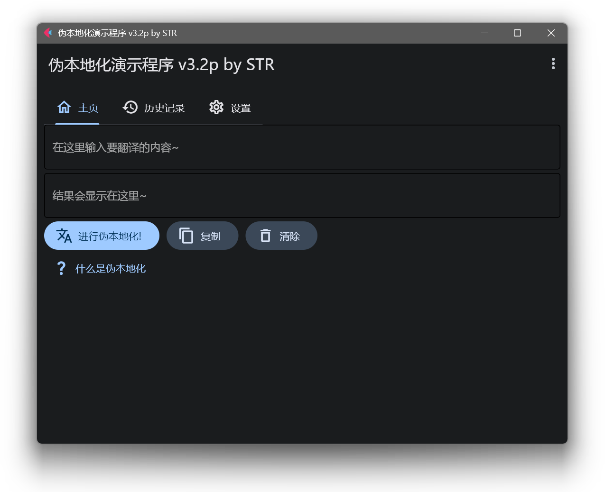

# 伪本地化演示程序

这是一个伪本地化工具，可用于某些本地化工作用途，当然也可以作为一个玩具或者工具

网页版：https://suntrise.github.io/pseudo

## 使用

注意，要在本地查看并修改源码，需要安装Python，版本最少为3.7以保障兼容性

### 编辑&使用

运行...

~~~Bash
pip install flet
pip install pyperclip
~~~

安装依赖，若需编辑旧版，则还需要额外运行......

~~~Bash
pip install PyQt5 
~~~

原则上`PyQt6`也行，各位可以试试

### 编译

#### Pyinstaller

运行......

~~~Bash
pip install pywin32
pip install pyinstaller
~~~

定位到代码根目录，运行......

~~~Bash
pyinstaller pslo.pyw -F -w -i pslo_icon.ico
~~~

编译完可能需要Wine或者Crossover才可以运行，因此我们依旧推荐直接执行pyw文件或使用下一种方案

#### Nuitka

请提前安装好**Visual Studio生成工具**或者**GCC（MinGW）**

运行......

~~~Bash
pip install nuitka
~~~

定位到代码根目录，运行......

~~~Bash
nuitka pslo.pyw --onefile --windows-disable-console --windows-icon-from-ico=pslo_icon.ico --standalone
~~~

适用于Windows和Linux，参数可以按需添加，详见[此处](https://github.com/Nuitka/Nuitka/)

## 使用到的第三方项目

### 2.x

[flet-dev/flet](https://github.com/flet-dev/flet)

[makinacorpus/django-paperclip](https://github.com/makinacorpus/django-paperclip)

### 1.x

[Riverbank Computing PyQt5](https://www.riverbankcomputing.com/software/pyqt/)
